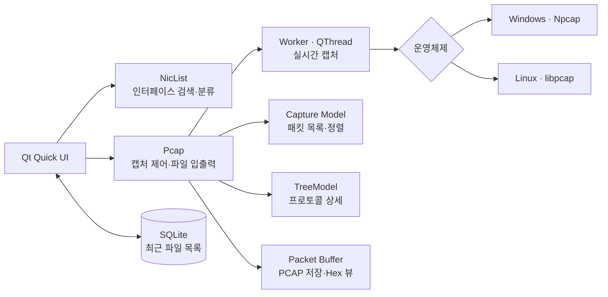

[Mini_Wireshark_README.md](https://github.com/user-attachments/files/30702446/Mini_Wireshark_README.md)
# Mini Wireshark

<p align="center">
  
</p>

<p align="center">
  Windows와 Linux에서 동작하는 Qt 기반의 경량 패킷 캡처·분석 도구
</p>

<p align="center">
  
  
  
  
</p>

Mini Wireshark는 네트워크 인터페이스에서 패킷을 실시간으로 수집하거나 저장된 PCAP/PCAPNG 파일을 열어 분석하는 교육용 데스크톱 애플리케이션입니다. 패킷 목록, BPF 필터, 프로토콜 상세 트리, Hex/ASCII 덤프, PCAP 저장 기능을 하나의 Qt Quick UI로 제공합니다.

Windows와 Linux가 별도 소스 트리로 나뉘어 있지는 않습니다. 하나의 코드베이스에서 CMake가 운영체제를 감지해 Windows에서는 **Npcap**, Linux에서는 **libpcap**을 연결합니다.

> 전체 프로토콜 분석기를 목표로 하는 Wireshark 대체품이 아니라, 패킷 캡처와 Ethernet/IPv4/TCP·UDP·ICMP 구조를 학습하기 위한 미니 분석기입니다.

## 주요 기능

- 시스템의 캡처 가능한 네트워크 인터페이스 자동 검색
- 전체, Wireless, Local(Ethernet), Virtual 인터페이스 분류
- 별도 작업 스레드에서 실시간 패킷 캡처
- 표준 BPF 문법을 이용한 캡처 필터
- PCAP/PCAPNG 파일 열기 및 최근 파일 목록 관리
- 캡처를 Ethernet 형식의 `.pcap` 파일로 저장
- 번호, 출발지, 목적지, 프로토콜, 길이 기준 정렬
- TCP, UDP, ICMP별 패킷 색상 구분
- 패킷 더블 클릭 시 계층형 헤더 분석
- Offset, 16진수 바이트, ASCII를 함께 표시하는 Hex 뷰
- IPv4 헤더 체크섬 검증

## 지원 범위

| 계층 | 현재 분석하는 항목 |
| --- | --- |
| Link | Ethernet II, 출발지/목적지 MAC, EtherType |
| Network | IPv4 버전, 헤더 길이, DSCP/ECN, 전체 길이, ID, 플래그, TTL, 프로토콜, 체크섬, 주소 |
| Transport | TCP 포트·Seq/Ack·헤더 길이·플래그·Window, UDP 포트·길이 |
| Control | ICMP Echo Reply/Request, Destination Unreachable, Redirect, Time Exceeded |
| Raw data | 16바이트 단위 Hex 및 ASCII 덤프 |

패킷 목록에는 Ethernet II 위의 IPv4 패킷 중 TCP, UDP, ICMP만 표시됩니다. ARP, IPv6, VLAN, DNS, HTTP/TLS 애플리케이션 계층 해석은 아직 지원하지 않습니다.

## 동작 구조



실시간 캡처는 `pcap_open_live()`로 인터페이스를 promiscuous mode로 열고, `pcap_loop()`를 전용 `QThread`에서 실행합니다. UI 갱신은 Qt queued connection을 통해 메인 스레드로 전달됩니다.

## Windows와 Linux 차이

| 항목 | Windows | Linux |
| --- | --- | --- |
| 캡처 라이브러리 | Npcap `wpcap`, `Packet` | system `libpcap` |
| 빌드 시 탐색 | `NPCAP_ROOT` 또는 저장소의 `third_party/npcap-sdk-1.13` | `pkg-config --libs libpcap` |
| 실행 전 준비 | Npcap Runtime 설치 | 캡처 권한 또는 Linux capabilities 설정 |
| 소켓 초기화 | `WSAStartup()` / `WSACleanup()` | POSIX socket API 직접 사용 |
| 권장 Qt kit | MSVC 2022 64-bit 또는 MinGW 64-bit | GCC 64-bit |

## BPF 필터 예시

필터 입력란은 libpcap/Npcap의 BPF 문법을 그대로 사용합니다. 비워 두면 지원 대상 패킷을 모두 수집합니다.

| 필터 | 의미 |
| --- | --- |
| `tcp` | TCP 패킷 |
| `udp or icmp` | UDP 또는 ICMP 패킷 |
| `port 53` | 출발지 또는 목적지 포트가 53 |
| `tcp port 443` | TCP 443 포트 |
| `src host 192.168.1.10` | 지정한 출발지 IPv4 주소 |
| `dst host 8.8.8.8` | 지정한 목적지 IPv4 주소 |
| `net 192.168.0.0/24` | 지정한 IPv4 네트워크 |

잘못된 필터는 현재 UI 팝업 대신 디버그 콘솔에 `pcap_compile` 오류로 출력됩니다.

## 요구 사항

### 공통

- CMake 3.16 이상
- Qt 6.8 이상
  - Core, Quick, Quick Window, Quick Controls, Quick Dialogs, Quick Layouts, Quick Effects, SQL
  - SQLite Qt SQL driver (`QSQLITE`)
- C++17 호환 컴파일러

### Windows

- Npcap Runtime
- Npcap SDK
  - 현재 저장소에는 `third_party/npcap-sdk-1.13`이 포함되어 있습니다.
  - 다른 SDK를 사용하려면 `NPCAP_ROOT`를 지정할 수 있습니다.
- Qt kit과 일치하는 64-bit 컴파일러

Npcap Runtime은 애플리케이션 실행에 필요하며 SDK의 헤더·라이브러리만으로는 실시간 캡처할 수 없습니다. 대상 PC에도 Runtime을 별도로 설치해야 합니다.

### Linux

- GCC 또는 Clang
- `pkg-config`
- libpcap 개발 패키지
- Qt 6.8 이상의 GCC kit

Ubuntu 계열에서 시스템 Qt 버전이 6.8 이상이라면 다음 패키지를 기반으로 준비할 수 있습니다.

```bash
sudo apt update
sudo apt install build-essential cmake ninja-build pkg-config libpcap-dev \
  qt6-base-dev qt6-declarative-dev \
  qml6-module-qtquick-controls qml6-module-qtquick-dialogs \
  qml6-module-qtquick-layouts qml6-module-qtquick-effects \
  qml6-module-qtquick-window
```

배포판의 Qt가 6.8보다 낮으면 Qt Online Installer의 Qt 6.8+ GCC 64-bit kit을 사용하세요.

## 빌드

### Windows — MinGW/Ninja

저장소에 포함된 Npcap SDK를 자동으로 찾으므로 Runtime과 Qt가 준비되어 있으면 바로 구성할 수 있습니다.

```powershell
cmake -S . -B build-windows -G Ninja `
  -DCMAKE_PREFIX_PATH=C:/Qt/6.9.3/mingw_64 `
  -DCMAKE_BUILD_TYPE=Release

cmake --build build-windows --parallel
```

실행:

```powershell
.\build-windows\appMini_Wireshark.exe
```

### Windows — MSVC 2022

```powershell
cmake -S . -B build-windows-msvc -A x64 `
  -DCMAKE_PREFIX_PATH=C:/Qt/6.9.3/msvc2022_64

cmake --build build-windows-msvc --config Release --parallel
```

외부 Npcap SDK를 사용할 때는 다음 중 하나를 추가합니다.

```powershell
-DNPCAP_ROOT=C:/dev/npcap-sdk
```

또는:

```powershell
$env:NPCAP_ROOT = "C:\dev\npcap-sdk"
```

배포 폴더에 Qt DLL과 QML 모듈을 복사하려면 사용한 Qt kit의 `windeployqt`를 실행합니다.

```powershell
windeployqt --qmldir . build-windows\appMini_Wireshark.exe
```

MSVC 다중 구성 빌드라면 실행 파일 경로를 `build-windows-msvc\Release\appMini_Wireshark.exe`로 바꾸세요.

### Linux

Qt가 시스템 기본 경로에 없다면 `CMAKE_PREFIX_PATH`로 Qt kit을 지정합니다.

```bash
cmake -S . -B build-linux -G Ninja \
  -DCMAKE_PREFIX_PATH="$HOME/Qt/6.8.3/gcc_64" \
  -DCMAKE_BUILD_TYPE=Release

cmake --build build-linux --parallel
```

실행:

```bash
./build-linux/appMini_Wireshark
```

## 캡처 권한

### Windows

Npcap 설치 옵션과 시스템 정책에 따라 일반 사용자로 캡처할 수 있습니다. 인터페이스가 보이지 않거나 `pcap_open_live failed`가 출력되면 Npcap 서비스 상태를 확인하고 애플리케이션을 관리자 권한으로 실행해 보세요.

### Linux

PCAP 파일 열기는 일반 사용자 권한으로 가능하지만 실시간 캡처에는 raw network 권한이 필요합니다. 매번 `sudo`로 GUI를 실행하는 대신 빌드된 실행 파일에 capabilities를 부여할 수 있습니다.

```bash
sudo setcap cap_net_raw,cap_net_admin=eip ./build-linux/appMini_Wireshark
getcap ./build-linux/appMini_Wireshark
```

실행 파일을 다시 빌드하거나 교체하면 capabilities가 사라질 수 있으므로 다시 설정해야 합니다.

## 사용 방법

1. 앱을 실행하면 캡처 가능한 인터페이스와 최근에 연 PCAP 파일이 표시됩니다.
2. 실시간 분석은 인터페이스 종류와 장치를 선택한 뒤 더블 클릭합니다.
3. 필요한 경우 BPF 필터를 입력하고 Start 버튼을 누릅니다.
4. Stop 버튼으로 캡처를 종료합니다.
5. 표의 헤더를 클릭하면 각 열을 기준으로 정렬할 수 있습니다.
6. 패킷 행을 더블 클릭하면 프로토콜 트리와 Hex/ASCII 덤프가 열립니다.
7. 캡처가 정지된 상태에서 Save 버튼으로 `.pcap` 파일을 저장합니다.
8. 기존 파일은 첫 화면의 **Open Pcap** 또는 **Recent captures**에서 엽니다.

## 로컬 데이터

최근에 연 파일 경로는 다음 위치의 SQLite DB에 저장됩니다.

```text
<QStandardPaths::AppDataLocation>/SQLITE/db_lite.sqlite3
```

패킷 원본은 캡처 중 메모리에 보관되며 PCAP 저장 또는 상세·Hex 조회에 사용됩니다. 최근 파일 DB에는 패킷 내용이 저장되지 않습니다.

## 프로젝트 구조

```text
Mini_Wireshark/
├─ main.cpp                 # Qt 앱 초기화 및 QML 타입 등록
├─ Pcap.*                   # 캡처 스레드, BPF, 파싱, PCAP 입출력, 상세 분석
├─ Capture.*                # 패킷 목록 모델 및 정렬
├─ NicList.*                # 네트워크 인터페이스 검색·분류
├─ Open_List.*              # 최근 파일 SQLite 모델
├─ TreeItem.*, TreeModel.*  # 프로토콜 상세 트리 모델
├─ PlatformCompat.h         # Windows/Linux 소켓·pcap 호환 계층
├─ Struct_in.h              # Ethernet, IPv4, TCP, UDP, ICMP 헤더 구조
├─ Main.qml                 # 메인 윈도우와 화면 StackView
├─ NicListView.qml          # 인터페이스 및 최근 파일 화면
├─ CaptureView.qml          # 캡처 제어와 패킷 목록
├─ PktView.qml              # 헤더 트리 및 Hex 뷰
├─ img/                     # UI 이미지와 SVG 리소스
├─ Trace_Sample/            # PCAP 분석용 샘플 파일
└─ third_party/             # Windows용 Npcap SDK
```

